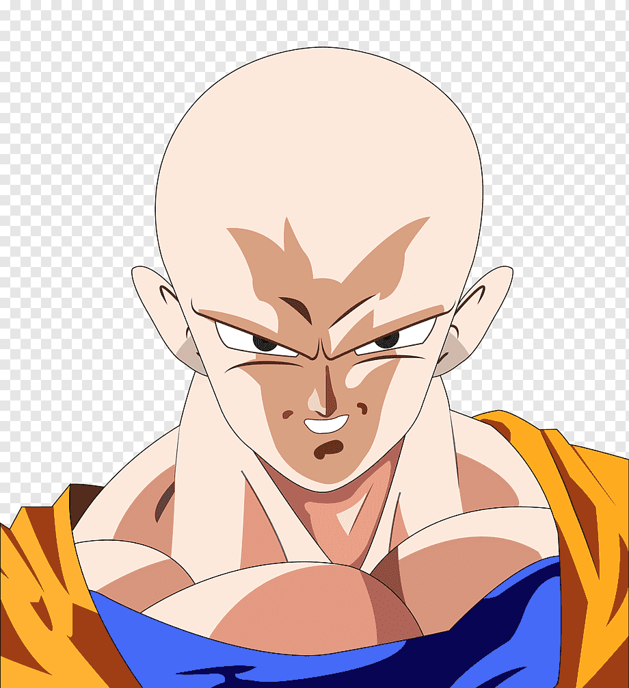

# Repaso_github
# Encabezado 1 (H1)
## Encabezado 2 (H2)
### Encabezado 3 (H3)
###### Encabezado 6 (H6)

*Este texto aparece en cursiva*
_Este texto aparece en cursiva_

**Este texto aparece en negrita**
__Este texto aparece en negrita__

Mi nombre es ***Mingu***

* dsa
* dnsa

- ds
- dsa

````html
<html>
  <head>
  </head>
</html>
````


[link](URL "texto alternativo")
[Enlace a wikipedia](https://es.wikipedia.org "Enlace a wikipedia")



| Encabezado1 | Encabezado2 | Encabezado 3|
|---------- |:------------:|--------:|
